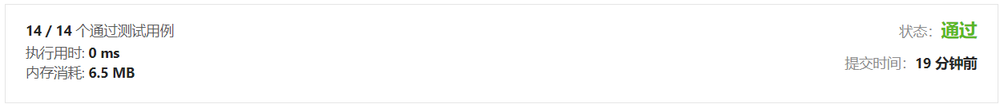

# [118. 杨辉三角](https://leetcode-cn.com/problems/pascals-triangle/) 


### 普通方法（效果不理想）

```cpp
class Solution
{
  public:
    vector<vector<int>> generate(int numRows)
    {

        if (numRows <= 0)
            return {};
        if (numRows == 1)
            return {{1}};

        auto result = vector<vector<int>>();
        result.push_back({1});

        for (int i = 0; i < numRows - 1; i++)
        {
            auto tempResult = vector<int>();
            tempResult.push_back({1});

            if (result[i].size() > 1)
            {
                for (auto j = 0; j < result[i].size() - 1; j++)
                    {
                        tempResult.push_back(result[i][j] + result[i][j + 1]);
                    }
            }
            tempResult.push_back({1});
            result.push_back(tempResult);
        }
        return result;
    }
};
```




## 其他题解


```cpp
class Solution {
public:
    vector<vector<int>> generate(int numRows) {
        // 建立框架
        vector<vector<int>> result(numRows);
        for(int n = 0; n < numRows; n++)
        {
            result[n].resize(n + 1);
        }
        // 先给边界加入1
        for(int i = 0; i < numRows; i++)
        {
            result[i][0] = 1;
            result[i][result[i].size() - 1] = 1;
        }
        // 然后按照杨辉三角加入数据（如果可能直接从第三行，从第二个元素开始，提前一个元素结束）
        for(int i = 2; i < numRows; i++)
        {
            for(int j = 1; j < result[i].size() - 1; j++)
                result[i][j] = result[i-1][j-1] + result[i-1][j];
        }
        return result; 
    }
};

作者：bei-zhi-hu
链接：https://leetcode-cn.com/problems/pascals-triangle/solution/cyang-hui-san-jiao-by-bei-zhi-hu-0rhe/
来源：力扣（LeetCode）
著作权归作者所有。商业转载请联系作者获得授权，非商业转载请注明出处。
```

