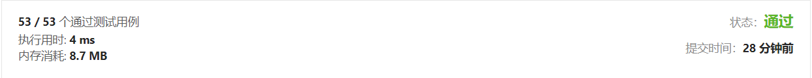
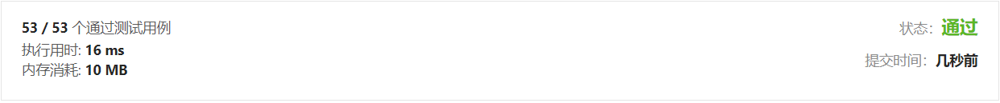
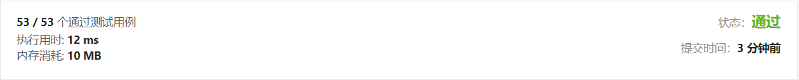
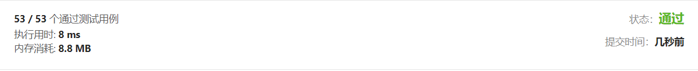
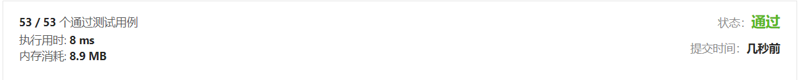

# [1. 两数之和](https://leetcode-cn.com/problems/two-sum/)


## 暴力法

```C++
class Solution
{
  public:
    vector<int> twoSum(vector<int> &nums, int target)
    {
        int j;
        auto size = nums.size();
        for (int i = 0; i < size - 1; i++)
        {
            for (j = i + 1; j < size; j++)
            {
                if (nums[i] + nums[j] == target)
                {
                    return {i, j};
                }
            }
        }
        return {};
    }
};
```



## 哈希表

**两遍哈希表，使用普通map**

```
class Solution
{
  public:
    vector<int> twoSum(vector<int> &nums, int target)
    {
        map<int, int> hashmap;
        auto size = nums.size();
        for (int i = 0; i < nums.size(); i++)
            hashmap.insert(map<int, int>::value_type(nums[i], i));

        for (int i = 0; i < size; i++)
        {
            if (hashmap.count(target - nums[i]) > 0 && (hashmap[target - nums[i]] != i))
            {
                return {i, hashmap[target - nums[i]]};
            }
        }
        return {};
    };
};

```



***

**两遍哈希，使用unordered_map**

```c++
class Solution
{
  public:
    vector<int> twoSum(vector<int> &nums, int target)
    {
        unordered_map<int, int> hashmap;
        auto size = nums.size();
        for (int i = 0; i < size; i++)
        {
            hashmap.insert(map<int, int>::value_type(nums[i], i));
        }
        for (int i = 0; i < size; i++)
        {
            if (hashmap.count(target - nums[i]) > 0 && hashmap[target - nums[i]] != i)
            {
                return {i, hashmap[target - nums[i]]};
            }
        }
        return {};
    }
};
```



***

**一遍哈希表**

```
class Solution
{
  public:
    vector<int> twoSum(vector<int> &nums, int target)
    {
        unordered_map<int, int> hashmap;
        auto size = nums.size();
        for (int i = 0; i < size; i++)
        {
            if (hashmap.count(target - nums[i]) > 0)
                return {hashmap[target - nums[i]] - 1, i};
            hashmap[nums[i]] = i + 1;
        }
        return {};
    }
};
```




## 排序+双指针法

> 思路来自leetcode[题解](https://leetcode-cn.com/problems/two-sum/solution/san-chong-fang-fa-bao-li-shuang-zhi-zhen-ha-xi-san/)

```C++
class Solution
{
  public:
    vector<int> twoSum(vector<int> &nums, int target)
    {

        vector<int> sortedNums(nums);
        std::sort(sortedNums.begin(), sortedNums.end());
        auto size = nums.size();

        int left = 0, right = size - 1;
        while (left < right)
        {
            if (sortedNums[left] + sortedNums[right] > target)
                right--;
            else if (sortedNums[left] + sortedNums[right] < target)
                left++;
            else
                break;
        }

        int leftResult, rightResult;
        if (left < right)
        {
            for (int i = 0; i < size; i++)
            {

                if (left < size && nums[i] == sortedNums[left])
                {
                    leftResult = i;
                    left = size;
                }
                else if (right < size && nums[i] == sortedNums[right])
                {
                    rightResult = i;
                    right = size;
                }
                if (left == size && right == size)
                    return {leftResult, rightResult};
            }
        }

        return {};
    }
};
```




